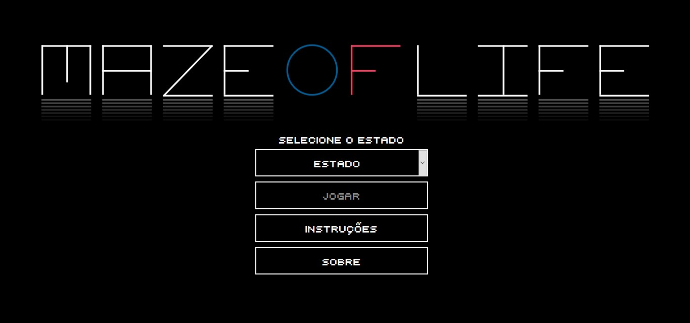

# Maze of Life

Maze of Life é um gamearte sobre distanciamento social, relações interpessoais, redes sociais e acesso a dados, tudo isso em forma de jogo de labirinto.

## Descrição

Um dos efeitos colaterais do isolamento social é o aumento do uso de plataformas e ferramentas digitais que impactam diretamente na quantidade de dados gerados e consumidos diariamente. Ao mesmo tempo, faltam dados e informações confiáveis, capazes de auxiliar a tomada de decisão e o combate/contenção da disseminação do novo coronavírus. Nesse contexto se faz importante refletir sobre qual o papel e o impacto desses dados na nossa percepção, afeto e decisões. De um ponto de vista metafórico, podemos compreender esse processo de tomada de decisão como um percurso em um labirinto escuro que não conhecemos, com um campo de visão limitado.

Além disso, as janelas virtuais e reais talvez nunca tenham ocupado um lugar tão destacado quanto ocupam hoje. O uso das plataformas e ferramentas digitais é realizado através das interfaces gráficas que utilizam a metáfora das janelas (windows). Todos os jogos, sites, redes sociais, aplicativos de videoconferência se dão através da utilização destas janelas virtuais, que permitem que sejam criados e mantidos os laços afetivos de maneira remota. Por outro lado, as janelas reais tornaram-se também um espaço de convivência, manifestação e afeto passando a ocupar um espaço antes reservado às ruas.
As relações físicas que envolvem contato interpessoal também ocupam um lugar importante no imaginário da pandemia pois determinam a taxa de disseminação do vírus. Esse contato entre diferentes agentes faz emergir, no sentido coletivo, uma nova composição social que pode, de certa forma, ser comparada ao Game of Life, ou Jogo da Vida. Este jogo, criado pelo matemático John Conway, se baseia em regras simples para determinar se uma célula (indivíduo) que compõe uma espécie de tecido social deve morrer, permanecer viva ou nascer baseada na relação com seus vizinhos.

Maze of Life é um gamearte que se debruça sobre estas questões, propondo ao jogador que encontre a saída em um labirinto gerado através da evolução de autômatos celulares baseados no Game of Life, uma homenagem póstuma ao Conway. Durante o percurso o interator possui um campo de visão limitado, proporcional ao grau de transparência e a quantidade de dados disponíveis sobre os casos do coronavírus na região do jogador. Durante a sua caminhada o jogador pode encontrar outros agentes inteligentes que se deslocam no labirinto e são oriundos dos dados georreferenciados em tempo real do Twitter. Do ponto de vista sonoro, a trilha do jogo é composta de maneira dinâmica através da utilização de sons baseados na vida cotidiana pré-isolamento social.

Por fim, caberá ao jogador trilhar seu próprio caminho no labirinto e decidir se irá interagir com os outros agentes e, portanto, se expor à possibilidade de contaminar e ser contaminado com o vírus. Então, vamos jogar?

## Como Jogar

É só baixar o conteúdo do repositório e servir dentro de um webserver (como o XAMPP por exemplo).

## Nós

O ICON - Laboratório de Pesquisa, Desenvolvimento e Inovação em Interatividade, Computação e Novas Interfaces - está localizado dentro do Instituto de Humanidades, Artes e Ciências Prof. Milton Santos (IHAC) na Universidade Federal da Bahia (UFBA) e tem como principal objetivo desenvolver pesquisas de relevância e impacto acadêmico, além de fomentar a inovação artística, científica e tecnológica nas áreas de arte computacional, criatividade computacional, inteligência artificial, interatividade, jogos e ambientes imersivos.

## Equipe
* Coordenação: Francisco Barretto
* Desenvolvimento: Ramon Freire, Victor Calazans
* Game Design: Fellipe Narde
* Trilha Sonora: André Bahiense, Fellipe Narde

## Vizualização

  
  
  

## Referências

Maze Generator and Explorer\
http://shuyangli.me/maze/index.html \
https://github.com/shuyangli94/shuyangli94.github.io/tree/master/maze

Procedural level design using an interactive cellular automata genetic algorithm: \
https://dl.acm.org/doi/10.1145/3067695.3075614?preflayout=flat

Procedural maze level generation with evolutionary cellular automata: \
https://ieeexplore.ieee.org/document/8285213/authors#authors

Evolving Cellular Automata for Maze Generation: \
https://link.springer.com/chapter/10.1007/978-3-319-14803-8_9

Evolving Cellular Automata for Maze Generation: \
https://www.researchgate.net/publication/283662301_Evolving_Cellular_Automata_for_Maze_Generation

Cellular Automata - Nature of Code: \
https://natureofcode.com/book/chapter-7-cellular-automata/

Portal Transparencia:  \
http://www.portaltransparencia.gov.br/	

Transparência COVID-19  \
https://transparenciacovid19.ok.org.br/

Twitter API \
https://developer.twitter.com/en/docs/tweets/search/api-reference

Codebird.js \
https://github.com/jublo/codebird-js

P5.js\
https://github.com/processing/p5.js
